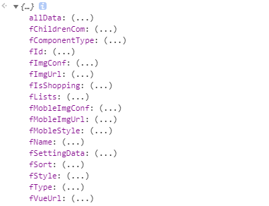

# 样式切换
::: tip 说明
#### 因各个组件样式切换的需求都不一样，无法在编辑器里面统一处理，故需要各组件自己处理，编辑器只返回数据。
:::

每个组件需要添加一个changeStyleCallback方法，作为切换样式的回调函数，方法里面接受一个对象，即需要切换的组件的所有数据。组件根据需要保留的数据重新处理这些数据。然后将处理好的数据对象返回即可。




changeStyleCallback方法里面有两种逻辑，适用不同的场景.
1. 将得到的obj重新处理并返回，即重新渲染选中的组件（适用于保留的属性较少的情况，例如只保留位置和宽高，其他任何样式都不保留的）
2. 修改当前选中组件本身的数据，不重新渲染组件，只是将得到的obj的某些属性赋值给当前组件this(使用于保留的属性很多的情况，只改变某几个样式的情况，例如组件的宽高、位置、圆角、字体等都保留，只需要改变组件的某个背景颜色等)

#### 以下针对上述两种情况分别举例说明（各组件根据需求选中不同的方式）

::: warning 提示
    第一种情况（重新渲染，需要返回值）
:::
```js 
    changeStyleCallback(obj){
        // obj就是上图显示的对象
        // 以下的this指的是当前选中的组件

        let newObj = JSON.parse(JSON.stringify({
            bigClass:this.prop.bigClass, //因组件只能在同类型之间切换样式，所以bigClass是不会变的，取当前组件的bigClass即可
            comName:obj.fName,
            fId: obj.fId, 
            url: obj.fVueUrl,
            settingData: JSON.parse(obj.fSettingData),
            style: obj.fStyle,
            mobileStyle: JSON.parse(obj.fMobleStyle),
            childData:JSON.parse(JSON.stringify(this.prop.childData)), //容器组件
            lists:JSON.parse(JSON.stringify(this.prop.lists)),
        }));

        newObj.settingData.inAllPage = this.settingData.inAllPage; //公共组件属性需要继承
        newObj.settingData.mobileComIsHide = this.settingData.mobileComIsHide //移动端隐藏属性需要继承
        

        // newObj重新渲染所需要的数据,如果需要保留宽高和位置，则需要修改newObj,例如
        newObj.style.top = this.style.top;
        newObj.style.left = this.style.left;
        newObj.style.width = this.style.width;
        newObj.style.height = this.style.height;

        return newObj

    }
```
::: warning 提示
    第二种情况（不需要重新渲染，只在当前选中组件修改数据，不需要返回值）
:::
```js 
    changeStyleCallback(obj){
        // obj就是上图显示的对象
        // 以下的this指的是当前选中的组件

        // 例如只需要将选中的样式的颜色和字体样式赋值给当前组件

        this.settingData.backgroundColor.value = obj.settingData.backgroundColor.value
        this.settingData.fontFamily.value = obj.settingData.fontFamily.value
        // 不需要返回值
    }
