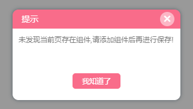
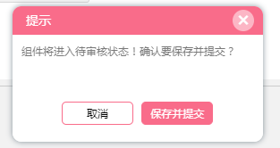

# 公用方法


## dialog(弹窗)
::: warning  提示
改方法仅适用于编辑模式和预览模式   不支持发布模式
:::
弹窗效果1:



弹窗效果2:


弹窗调用方法:
```js
zmEditor.$store.commit('openInfoDialog',{
    oneBtnCallback: null, //第一个按钮的事件回调
    twoBtnCallback: null, //第二个按钮的事件回调
    BtnNum: null, //提示弹窗的按钮个数   默认值为 1  最大值为 2
    oneBtnTitle: null, //第一个按钮名称  当  btnNum 为1时  默认值为 我知道了  ,为 2 时的默认值为 取消
    twoBtnTitle: null, //第二个按钮名称  默认值为 确认
    content: null, //提示的内容   html 或 String
    title: null, //提示弹窗的的标题  默认值为提示
    isStopClose: false,//是否阻止弹窗自带的关闭事件  默认为不阻止
});

//上述按钮的回调默认带入了关闭弹窗事件  参数按需输入即可
```

## Parameter(弹窗)
::: warning  提示
该弹窗仅适用于 预览模式  和  发布模式  
:::
::: tip  提示
该弹窗只加载弹窗的遮罩层, 中间的内容层需要自己自定义 内容层已设置居中 css, (PS:内容层的的 width 和 height 属性设置为偶数,奇数会导致内容层中的内容模糊) 
:::
弹窗调用方法:

```js
zmEditor.$store.commit('setComDialogParameter',{
    comDialogVueUrl:null;  // 自定义弹窗的 vue 路径 与 组件的写入的族蚂后台的 vue 路径格式一致
    comDialogValue:null;   // 弹窗需要进行中转的参数  按自己的需求传值  接收使用父子的组件的传值的方式  参数命名为  prop
};
```
弹窗关闭方法:
```js
zmEditor.$store.commit('closeComDialog');
```
